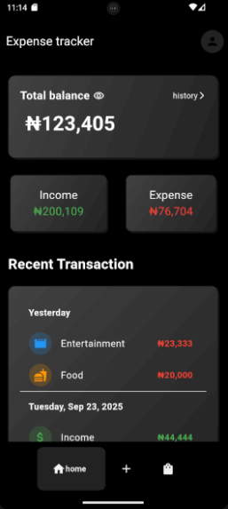
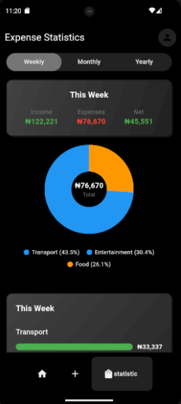
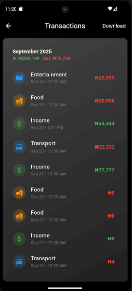

# 💰 Flutter Expense Tracker

A modern, feature-rich expense tracking application built with Flutter that helps users manage their personal finances with ease. Track income, expenses, and get insightful analytics across different time periods.

## ✨ Features

### 📊 **Financial Management**

- ✅ Add and categorize income & expenses
- ✅ Real-time balance calculation
- ✅ Multi-currency support (₦ Naira)
- ✅ Date-based transaction organization

### 📈 **Analytics & Insights**

- ✅ Interactive pie charts for expense breakdown
- ✅ Category-wise spending analysis
- ✅ Weekly, Monthly & Yearly statistics
- ✅ Visual spending bars with progress indicators

### 🎨 **User Experience**

- ✅ Clean, modern Material Design UI
- ✅ Dark/Light theme toggle
- ✅ Responsive design for all screen sizes
- ✅ Smooth animations and transitions
- ✅ Intuitive navigation with bottom tabs

### 🔧 **Technical Features**

- ✅ Offline-first with Hive local database
- ✅ State management with Provider
- ✅ Custom input formatters (thousands separator)
- ✅ Grouped transaction views
- ✅ Export functionality (planned)

## 📱 Screenshots

| Dashboard | Add Expense | Statistics | History |
|-----------|-------------|------------|---------|
|  |  |  |  |

## 🚀 Getting Started

### Prerequisites

- Flutter SDK (>=3.0.0)
- Dart SDK (>=3.0.0)
- Android Studio / VS Code
- Git

### Installation

1. **Clone the repository**

   ```bash
   git clone https://github.com/yourusername/flutter-expense-tracker.git
   cd flutter-expense-tracker
   ```

2. **Install dependencies**

   ```bash
   flutter pub get
   ```

3. **Generate Hive adapters**

   ```bash
   flutter packages pub run build_runner build
   ```

4. **Run the app**

   ```bash
   flutter run
   ```

## 🏗️ Project Structure

```
lib/
├── components/           # Reusable UI components
│   ├── grouped_transactions.dart
│   ├── pie_chart_painter.dart
│   ├── my_nav_bar.dart
│   └── ...
├── database/            # Local database setup
│   └── expense_database.dart
├── models/              # Data models
│   ├── expense_details.dart
│   └── category.dart
├── pages/               # App screens
│   ├── dashboard_page.dart
│   ├── expense_page.dart
│   ├── statistic_page.dart
│   └── ...
├── service/             # Services & utilities
│   └── theme/
├── util/                # Helper utilities
│   └── finance_util.dart
└── main.dart           # App entry point
```

## 📦 Dependencies

| Package | Version | Purpose |
|---------|---------|---------|
| `flutter` | SDK | Core framework |
| `hive_flutter` | ^1.1.0 | Local database |
| `provider` | ^6.0.0 | State management |
| `intl` | ^0.19.0 | Internationalization & formatting |
| `google_nav_bar` | ^5.0.6 | Bottom navigation |
| `font_awesome_flutter` | ^10.6.0 | Icons |

## 🎯 Usage

### Adding Transactions

1. Navigate to the "Expenses" tab
2. Enter amount, select category, and date
3. Add optional notes
4. Tap "Save" to record the transaction

### Viewing Statistics

1. Go to the "Statistics" tab
2. Switch between Weekly, Monthly, and Yearly views
3. Analyze spending patterns with pie charts and bar graphs
4. View income vs. expense breakdown

### Managing Categories

The app supports these expense categories:

- 🍔 Food & Dining
- 🏠 Bills & Utilities
- 🚗 Transportation
- 🛍️ Shopping
- 🎬 Entertainment
- 💊 Health & Medical
- 💰 Income
- 📦 Other

## 🛠️ Development

### Architecture

- **Pattern**: Provider + Repository Pattern
- **Database**: Hive (NoSQL, offline-first)
- **State Management**: Provider
- **UI**: Material Design 3

### Key Classes

- `ExpenseDetails`: Core expense model with Hive annotations
- `ExpenseDatabase`: Database operations and state management
- `FinanceUtils`: Consolidated financial calculation utilities
- `GroupedTransactions`: Flexible transaction grouping component

### Recent Improvements

- ✅ Consolidated duplicate financial calculation methods
- ✅ Centralized expense filtering and sorting logic
- ✅ Improved code maintainability by reducing ~150 lines of duplicate code
- ✅ Enhanced performance with unified FinanceUtils

## 🧪 Testing

```bash
# Run unit tests
flutter test

# Run integration tests
flutter test integration_test/

# Generate test coverage
flutter test --coverage
```

## 📱 Building

### Android

```bash
flutter build apk --release
```

### iOS

```bash
flutter build ios --release
```

## 🤝 Contributing

1. Fork the repository
2. Create your feature branch (`git checkout -b feature/amazing-feature`)
3. Commit your changes (`git commit -m 'Add some amazing feature'`)
4. Push to the branch (`git push origin feature/amazing-feature`)
5. Open a Pull Request

### Development Guidelines

- Follow Flutter/Dart style guide
- Use meaningful commit messages
- Add tests for new features
- Update documentation as needed


## 📄 License

This project is licensed under the MIT License - see the [LICENSE](LICENSE) file for details.


## 🙏 Acknowledgments

- Flutter team for the amazing framework
- Hive for efficient local storage
- Material Design team for design guidelines
- Open source community for inspiration


---

<div align="center">
  <p>Made with ❤️ and Flutter</p>
  <p>⭐ Star this repo if you found it helpful!</p>
</div>
